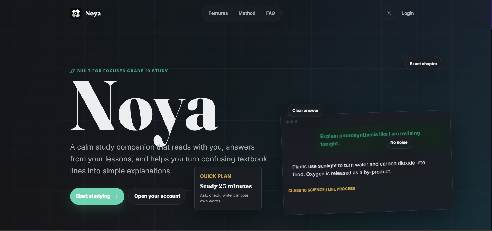
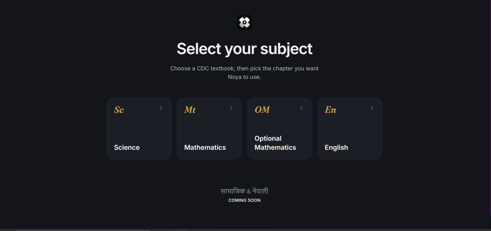
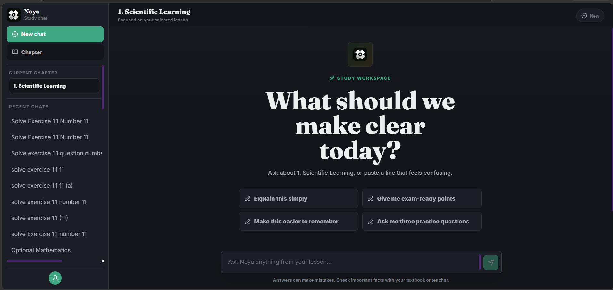
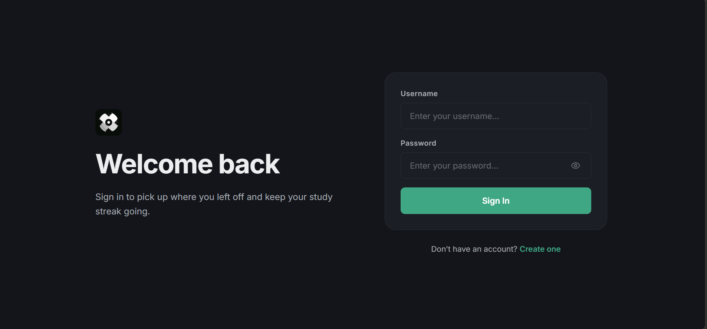
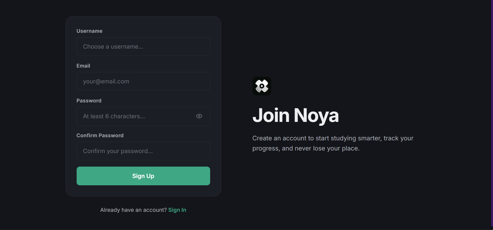

<p align="center">
  <picture>
    <source media="(prefers-color-scheme: dark)" srcset="frontend/src/assets/noya-logo.svg">
    
  </picture>
</p>

<h1 align="center">Noya</h1>

<p align="center">
  <b>A calm AI study companion for Grade 10 CDC curriculum students in Nepal.</b><br>
  Grounded answers. Textbook-first. No hallucinations.
</p>

<p align="center">
  
  
  
  
  
</p>

---

## Table of Contents

- [About](#about)
- [Features](#features)
- [Tech Stack](#tech-stack)
- [Architecture](#architecture)
- [RAG Pipeline](#rag-pipeline)
- [Caching Architecture](#caching-architecture)
- [File Structure](#file-structure)
- [Local Development](#local-development)
- [Environment Variables](#environment-variables)
- [API Endpoints](#api-endpoints)
- [License](#license)

---

## About

Noya (formerly Padh.AI) is a **Retrieval-Augmented Generation (RAG)** educational assistant purpose-built for **Grade 10 students** following Nepal's **CDC (Curriculum Development Centre) national curriculum**.

Unlike generic AI chatbots that hallucinate, every Noya response is **grounded in actual CDC textbook content**. Select a subject and chapter, and Noya answers using only the textbook text for that specific chapter — with citations back to specific page numbers.

The product philosophy: *"A calm study companion that reads with you, answers from your lessons, and helps you turn confusing textbook lines into simple explanations."*

---

## Features

- **Textbook-Grounded AI Chat** — RAG-powered answers sourced from CDC PDFs with page-level citations
- **Subject & Chapter Selection** — Science, Mathematics, Optional Mathematics, English (Social Studies & Nepali coming soon)
- **Streaming Responses** — word-by-word answer generation preview for a natural reading experience
- **4-Tier Semantic Cache** — In-memory LRU → DB fingerprint → Knowledge Base → Fuzzy semantic matching
- **JWT Authentication** — Secure register/login with access + refresh token rotation
- **Dark / Light Theme** — Clean, minimal design with full CSS custom property theming
- **Markdown + LaTeX Rendering** — KaTeX-powered math expressions, syntax-highlighted code blocks, interactive tooltips for hard words
- **Chat Sessions** — Create, save, load, and delete conversation histories
- **Free & Paid Plans** — billing integration with plan-based model selection
- **Referral System** — Built-in referral code generation and tracking
- **Analytics** — Event tracking and per-user usage statistics


---

## Tech Stack

| Category | Technology |
|----------|-----------|
| **Frontend** | React 18, Vite 5, React Router 6, Tailwind CSS 3, KaTeX (LaTeX math), Lucide icons |
| **Backend** | Django 4.2+, Django REST Framework |
| **Authentication** | SimpleJWT (access / refresh tokens with blacklisting) |
| **Database** | PostgreSQL (Supabase) / SQLite (development fallback) |
| **Vector Store** | Qdrant Cloud (384-d embeddings) |
| **Embedding Model** | `paraphrase-multilingual-MiniLM-L12-v2` (Sentence Transformers) |
| **LLM Providers** | Gemini (primary), DeepSeek (fallback), Kira AI (backup), Groq (titles/classification) |
| **PDF Parsing** | pypdf + LangChain |
| **Caching** | 4-tier semantic cache + in-memory LRU (512 entries) |
| **Styling** | CSS custom properties, Tailwind utility classes |

---

## Architecture

```
┌──────────────────────────────────────────────────────────────────┐
│                         Browser (React)                          │
│                                                                  │
│   ┌──────────────┐  ┌──────────┐  ┌─────────────────────────┐   │
│   │  Login/Signup │  │  Subject │  │       ChatView          │   │
│   │               │  │ Selection│  │  ┌──────────────────┐  │   │
│   │  JWT tokens   │  │          │  │  │ MarkdownRenderer │  │   │
│   │  stored in    │  │  Grid of │  │  │  (KaTeX LaTeX)   │  │   │
│   │  localStorage │  │ subjects │  │  │  + code blocks   │  │   │
│   └───────┬───────┘  └────┬─────┘  │  └──────────────────┘  │   │
│           │               │         │  SSE streaming         │   │
│           ▼               ▼         ▼        │               │   │
│        AuthContext ──── Axios Interceptor ────┘               │   │
│                        Bearer token                            │   │
└──────────────────────────────┬──────────────────────────────────┘
                               │ HTTP / SSE
                               ▼
┌──────────────────────────────────────────────────────────────────┐
│                      Django REST API                             │
│                                                                  │
│   ┌──────────────┐  ┌──────────────┐  ┌──────────────────────┐  │
│   │  Auth Views  │  │  Chat Views  │  │  Billing Views       │  │
│   │  /api/auth/  │  │  /api/chat/  │  │  /api/billing/       │  │
│   └──────┬───────┘  └──────┬───────┘  └──────────┬───────────┘  │
│          │                 │                      │              │
│          ▼                 ▼                      ▼              │
│   ┌─────────────────────────────────────────────────────────┐   │
│   │                   AIService (Orchestrator)               │   │
│   │                                                         │   │
│   │   ┌──────────────┐   ┌──────────────┐   ┌────────────┐ │   │
│   │   │ Gemini Client │   │ RAGService   │   │ Semantic   │ │   │
│   │   │ DeepSeek      │   │ (Qdrant)     │   │ Cache      │ │   │
│   │   │ Kira AI       │   │              │   │ (4 tiers)  │ │   │
│   │   │ Groq          │   └──────┬───────┘   └──────┬─────┘ │   │
│   │   └──────┬───────┘          │                  │       │   │
│   └──────────┼──────────────────┼──────────────────┼───────┘   │
│              │                  │                  │           │
└──────────────┼──────────────────┼──────────────────┼───────────┘
               │                  │                  │
         ┌─────▼────┐     ┌──────▼──────┐    ┌──────▼──────┐
         │  Gemini  │     │  Qdrant     │    │ PostgreSQL  │
         │  DeepSeek│     │  Cloud      │    │ (Supabase)  │
         │  Kira AI │     │  (384-d     │    │             │
         │  Groq    │     │   vectors)  │    │ • users     │
         └──────────┘     └─────────────┘    │ • sessions  │
                                             │ • messages  │
                                             │ • cache     │
                                             │ • billing   │
                                             └─────────────┘
```

---

## RAG Pipeline

```
User Question
     │
     ▼
┌──────────────────────────────────────────────────────┐
│                 AIService.chat()                      │
│                                                      │
  │  ┌─ Chapter title provided? ─┐                       │
│  │          │                │                       │
│  │         YES               NO                      │
│  │          │                │                       │
│  │          ▼                ▼                       │
│  │  Extract PDF text    Qdrant similarity            │
│  │  for chapter pages   search (top-5 chunks)        │
│  │          │                │                       │
│  │          ▼                ▼                       │
│  │  Grounding Verification (deterministic token      │
│  │  overlap check against textbook source)           │
│  │          │                                         │
│  │          ▼                                         │
│  │  ┌─ Cache Hit? ──────────────────────────┐         │
│  │  │           │                            │         │
│  │  │          YES                          NO        │
│  │  │           │                            │         │
│  │  │           ▼                            ▼         │
│  │  │    Return cached               Gemini 2.5 Flash  │
│  │  │    answer (<50ms)              generates answer  │
│  │  │                                     │           │
│  │  │                                     ▼           │
│  │  │                              Quality scoring    │
│  │  │                                     │           │
│  │  └───────────── All paths ─────────────┘           │
│  │                                                    │
│  │  Save answer + context to ChatMessage in DB        │
│  │  Warm cache via SemanticCache.learn_from_ai()      │
│  │  Stream response to frontend via SSE               │
│  └────────────────────────────────────────────────────┘
```

---

## Caching Architecture

```
Request
   │
   ▼
┌─────────────────────────────────────────────────────────┐
│  Tier 1: In-Memory LRU Cache                            │
│  • Dict with max 512 entries, O(1) lookup               │
│  • Latency: <1ms                                        │
│  • Eviction: LRU (Least Recently Used)                  │
│               │                                          │
│              MISS                                        │
│               ▼                                          │
├─────────────────────────────────────────────────────────┤
│  Tier 2: DB Fingerprint                                  │
│  • SHA256 hash of normalized query + context            │
│  • Indexed column in SemanticAnswerCache table          │
│  • Latency: ~5ms                                        │
│               │                                          │
│              MISS                                        │
│               ▼                                          │
├─────────────────────────────────────────────────────────┤
│  Tier 3: Knowledge Base                                  │
│  • Precomputed textbook entries by AI                   │
│  • Filtered by grade → subject → chapter                │
│  • Scored via cosine similarity on 192-d hash vectors   │
│  • Latency: ~20ms                                       │
│               │                                          │
│              MISS                                        │
│               ▼                                          │
├─────────────────────────────────────────────────────────┤
│  Tier 4: Semantic Fuzzy Match                            │
│  • Same-scope SemanticAnswerCache entries               │
│  • Multi-factor scoring:                                │
│    • Semantic similarity (60%)  ← 192-d cosine          │
│    • Topic overlap (15%)       ← Jaccard               │
│    • Quality score (15%)       ← AI eval               │
│    • Student feedback (5%)     ← rating                │
│    • Hallucination risk (-5%)  ← penalty               │
│  • Early exit if score ≥ 0.92                           │
│  • Latency: ~50ms                                       │
│               │                                          │
│              MISS                                        │
│               ▼                                          │
├─────────────────────────────────────────────────────────┤
│  Gemini API Call                                         │
│  • 2.5 Flash (free) / 2.5 Pro (paid)                    │
│  • Temperature: 0.3 (low for factual answers)           │
│  • Max output tokens: 4096                              │
│  • Latency: ~2-5s                                       │
│               │                                          │
│               ▼                                          │
│  Answer scored + saved to all 4 cache tiers             │
└─────────────────────────────────────────────────────────┘
```

---

## File Structure

```
Noya/
│
├── frontend/                          # React + Vite SPA
│   ├── public/
│   ├── src/
│   │   ├── assets/                    # Logo, favicon
│   │   ├── components/
│   │   │   ├── ChatView.jsx           # Main chat (SSE streaming, sessions)
│   │   │   ├── SubjectSelection.jsx   # Grid of subjects + chapters
│   │   │   ├── Login.jsx              # JWT login form
│   │   │   ├── SignUp.jsx             # Registration with referral
│   │   │   ├── MarkdownRenderer.jsx   # KaTeX LaTeX, code blocks, tooltips
│   │   │   └── FormField.jsx          # Reusable input component
│   │   ├── context/AuthContext.jsx    # React Context for JWT auth state
│   │   ├── data/curriculum.js         # CDC subject + chapter definitions
│   │   ├── services/api.js            # Axios client with JWT interceptor
│   │   ├── firebase/                  # Firebase config (legacy)
│   │   ├── styles/                    # Design token CSS
│   │   ├── tokens.css                 # CSS custom properties
│   │   ├── index.css                  # Global styles + Tailwind
│   │   ├── App.jsx                    # Router + AuthProvider
│   │   └── main.jsx                   # Vite entry point
│   ├── package.json
│   └── vite.config.js
│
├── backend-main/                      # Django REST API
│   ├── backend/
│   │   └── settings.py                # Django config (DB, JWT, CORS, cache)
│   ├── api/
│   │   ├── ai_service.py              # LLM orchestration (Gemini/DeepSeek/Kira)
│   │   ├── rag_service.py             # Qdrant vector search + PDF ingestion
│   │   ├── semantic_cache.py          # 4-tier semantic caching system
│   │   ├── chapter_pdf_context.py     # Page-range maps per subject/chapter
│   │   ├── curriculum_scope.py        # Subject detection + out-of-scope handling
│   │   ├── content_processor.py       # AI-powered textbook transformation
│   │   ├── models.py                  # User, ChatSession, ChatMessage, Cache
│   │   ├── serializers.py             # DRF serializers
│   │   ├── views.py                   # All API endpoints
│   │   ├── urls.py                    # Route definitions
│   │   ├── admin.py                   # Django admin configuration
│   │   └── apps.py                    # App config + RAG warmup
│   ├── cdc_curriculum/                # CDC textbook PDFs (class_10/)
│   ├── manage.py                      # Django management script
│   └── requirements.txt               # Python dependencies
│
├── .env.example                       # Environment variable template
├── PRODUCT.md                         # Product vision & design principles
└── README.md                          # This file
```

---

## Local Development

### Prerequisites

- **Python 3.10+** — [python.org](https://python.org/downloads)
- **Node.js 18+** — [nodejs.org](https://nodejs.org)
- **Git** — [git-scm.com](https://git-scm.com)

### 1. Clone the Repository

```bash
git clone <repo-url>
cd Noya
```

### 2. Configure Environment Variables

```bash
# Windows (Command Prompt)
copy .env.example backend-main\.env

# Windows (PowerShell)
Copy-Item .env.example backend-main\.env

# macOS / Linux
cp .env.example backend-main/.env
```

**You MUST manually edit `backend-main/.env`** with your own API keys and database URL. At minimum, set:

- `SECRET_KEY` — generate with: `python -c "import secrets; print(secrets.token_hex(32))"`
- `GEMINI_API_KEY_1` — from [Google AI Studio](https://aistudio.google.com/apikey)
- `QDRANT_URL` + `QDRANT_API_KEY` — from [Qdrant Cloud](https://cloud.qdrant.io)
- `DATABASE_URL` — PostgreSQL connection string (Supabase, Neon, or local). Leave empty to use SQLite for local dev.

Optional but recommended for full functionality:
- `DEEPSEEK_API_KEY_1` — fallback LLM provider ([DeepSeek](https://platform.deepseek.com))
- `GROQ_API_KEY_1` — title generation & question classification ([Groq](https://console.groq.com))
- `KIRAA_API_KEY_1` — backup LLM provider ([Kira AI](https://kiraai.vn))

### 3. Backend Setup

```bash
cd backend-main

# Create virtual environment
python -m venv venv

# Activate virtual environment (run ONLY the one for your OS)
# Windows (PowerShell)
.\venv\Scripts\Activate.ps1
# Windows (Command Prompt)
venv\Scripts\activate.bat
# Windows (Git Bash) / macOS / Linux
source venv/bin/activate

# Install dependencies
pip install -r requirements.txt

# Run database migrations
python manage.py migrate

# Start development server
python manage.py runserver
```

Backend starts at **http://localhost:8000**

### 4. Frontend Setup

Open a **new terminal** (keep the backend running):

```bash
cd frontend

# Install dependencies
npm install

# Start development server
npm run dev
```

Frontend starts at **http://localhost:5173**

### 5. Open the App

Navigate to **http://localhost:5173**, register an account, select a subject, and start studying.

---

## Environment Variables

Copy `.env.example` to `backend-main/.env` (see Step 2 above) and configure:

| Variable | Required | Description |
|----------|----------|-------------|
| `SECRET_KEY` | Yes | Django secret key (generate with `python -c "import secrets; print(secrets.token_hex(32))"`) |
| `DATABASE_URL` | No | PostgreSQL URL. Falls back to SQLite if empty |
| `GEMINI_API_KEY_1` | Yes | Google Gemini API key ([get one here](https://aistudio.google.com/apikey)) |
| `QDRANT_URL` | Yes | Qdrant Cloud cluster URL |
| `QDRANT_API_KEY` | Yes | Qdrant Cloud API key |
| `DEEPSEEK_API_KEY_1` | No | DeepSeek API key (fallback LLM provider) |
| `KIRAA_API_KEY_1` | No | Kira AI API key (backup LLM provider) |
| `GROQ_API_KEY_1` | No | Groq API key (title generation + question classification) |
| `DEBUG` | No | Set to `true` for development (default: `false`) |
| `ALLOWED_HOSTS` | No | Comma-separated list of allowed hosts (default: `localhost,127.0.0.1`) |
| `CORS_ALLOWED_ORIGINS` | No | Comma-separated CORS origins (default: `http://localhost:5173`) |

### Frontend Variables

Create `frontend/.env`:

```
VITE_API_URL=http://localhost:8000
```

Firebase variables are legacy and not required for local development.

---

## API Endpoints

### Authentication

| Method | Endpoint | Description |
|--------|----------|-------------|
| POST | `/api/auth/register/` | Create account (username, email, password, referral) |
| POST | `/api/auth/login/` | Obtain JWT tokens |
| POST | `/api/auth/refresh/` | Refresh access token |
| POST | `/api/auth/logout/` | Blacklist refresh token |
| GET | `/api/auth/user/` | Get current user profile |
| PATCH | `/api/auth/user/` | Update profile (grade, school, bio) |

### Chat

| Method | Endpoint | Description |
|--------|----------|-------------|
| POST | `/api/chat/` | Send message (SSE streaming response) |
| GET | `/api/chat/sessions/` | List chat sessions |
| GET | `/api/chat/sessions/:id/` | Load session with full message history |

### Billing

| Method | Endpoint | Description |
|--------|----------|-------------|
| GET | `/api/billing/plans/` | List available subscription plans |
| POST | `/api/billing/checkout/` | Create Stripe Checkout Session |
| GET | `/api/billing/status/` | Get current user's billing status |
| POST | `/api/billing/webhook/` | Stripe webhook handler |

### RAG

| Method | Endpoint | Description |
|--------|----------|-------------|
| GET | `/rag/status/` | RAG system health check |
| POST | `/rag/init/` | Initialize / re-ingest PDF textbooks |
| POST | `/rag/search/` | Manual curriculum search (debug) |

### System

| Method | Endpoint | Description |
|--------|----------|-------------|
| GET | `/api/stats/` | Usage statistics (messages, sessions) |
| GET | `/api/cache/metrics/` | Cache hit rates and latency |
| GET | `/api/system/check/` | Full system health check |

---

## Knowledge Base & Cache

The semantic cache is the backbone of Noya's performance. After each AI-generated answer, the system:

1. **Computes** a 192-d deterministic hash embedding (`blake2b`-based) of the query + response
2. **Scores** the answer for quality (length, structure, groundedness, hallucination risk)
3. **Stores** it in `SemanticAnswerCache` if quality ≥ 0.74
4. **Warms** the in-memory LRU for instant subsequent lookups

Over time, the cache **compounds** — every answered question becomes free for every future student. Common questions saturate the cache, and the system serves 90%+ of requests without touching the LLM.

UI Preview:

The frontend features a clean, minimal design built with Tailwind CSS and React. Key UI components include:

- **Subject Selection Grid**: Browse available subjects (Science, Mathematics, English) and chapters
- **Chat View**: Real-time messaging interface with streaming responses
- **Markdown Renderer**: KaTeX-powered LaTeX math rendering, syntax-highlighted code blocks, and interactive tooltips for difficult vocabulary
- **Dark/Light Theme**: Automatic system preference detection with manual toggle option
- **Session Management**: Create, save, load, and delete chat conversations
- **Responsive Design**: Mobile-first layout with adaptive navigation

<p align="center">
  
  
  
  
  
</p>

<p align="center">
  <strong>Developed, Designed, and Created by Sabal Bajagain</strong>
</p>