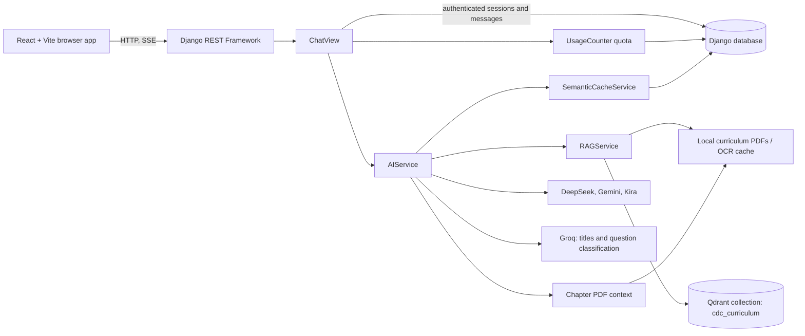

# Architecture

This page describes the implementation in this repository. It does not describe a planned production architecture.

## Runtime components

The frontend calls the API at `VITE_API_URL` (default `http://localhost:8000/api`). Chat responses are returned as Server-Sent Events. The Django app uses JWT authentication; chat is also available to guests, while saved sessions and message history are account-specific.

## Chat request flow

1. `POST /api/chat/` reserves the request against the server-side rate and chat quotas.
2. For an authenticated user, the API loads or creates the selected chat session and builds recent conversation context.
3. `AIService.chat()` checks selected-chapter PDF context when a chapter is supplied. If that text is available, it performs the deterministic grounding check, then checks the cache/knowledge base, and requests a model answer on a miss.
4. If selected-chapter text is unavailable, the fallback path checks the cache/knowledge base, queries Qdrant when RAG is available, and checks retrieved context before requesting an answer.
5. Successful non-cache answers are charged to the usage counter. Authenticated messages are saved to the database. The response is streamed to the browser.

Cache hits and failed model generations do not consume daily/monthly quota. The per-minute request limit counts attempts. See [RAG pipeline](RAG_PIPELINE.md) and [cache implementation](cache_architecture.md) for details.

## Model routing

`AIService._generate()` classifies the question as simple or complex/diagram-like. Both routes try DeepSeek first. Simple questions then try Kira and Gemini; other questions try Gemini and then Kira. Gemini has a model fallback list, and each provider can use configured keys. Groq is not an answer-generation provider in this path: title generation uses Groq only, with a local title heuristic if Groq fails; question classification can use Groq with a rule-based fallback.

When the optional Pro billing code is enabled, `pro_ai.py` may choose paid models. Billing and Pro UI are optional and are gated by `api/features.py`.

## Data and external services

- **Application data:** Django models store users, sessions, messages, usage counters, cache entries, and cache lookup events.
- **SQL database:** SQLite is used when `DATABASE_URL` is empty. A PostgreSQL URL can be configured with `DATABASE_URL`; the settings enable SSL for that URL.
- **RAG vector store:** Qdrant is a separate service. The RAG collection is named `cdc_curriculum`; it stores PDF chunk vectors and payloads.
- **PDFs:** RAG and selected-chapter retrieval read local files under `backend-main/api/cdc_curriculum/`. Those PDFs are not included in this checkout.
- **Embeddings:** Qdrant PDF embeddings use `paraphrase-multilingual-MiniLM-L12-v2` from Sentence Transformers. The semantic answer cache uses a deterministic, locally computed hashed-token vector; it does not use that model or a hosted embedding API.
- **AI providers:** DeepSeek, Gemini, and Kira are called by the answer router. Groq is used for the title/classification side tasks.

## Boundaries and items not present

The repository does not configure or run a Celery worker, Redis cache, `pgvector`, scheduled cache-maintenance jobs, or a separate vector-indexing service. Celery-related settings are placeholders/comments only. Cache indexing, PDF indexing, and content precomputation are run through Django commands or API views rather than a background job system.

