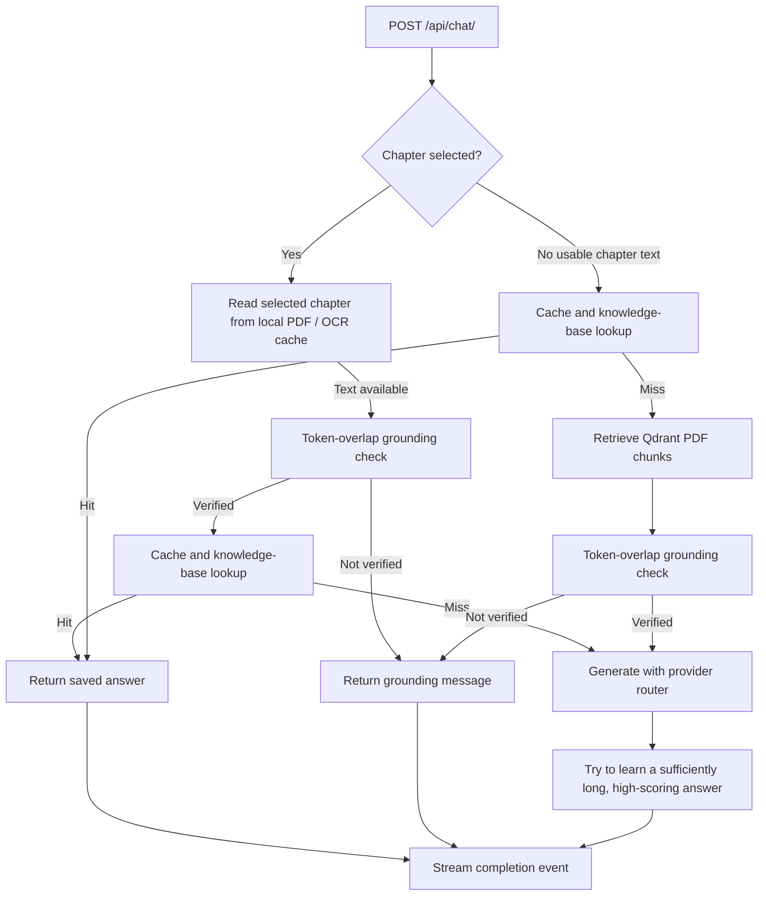

# RAG and textbook context

This describes the two textbook-context paths implemented by `AIService`. The application can run without RAG, but textbook grounding depends on local curriculum files and, for the vector search path, a reachable Qdrant service.

## Chat answer flow



The grounding check is deterministic token overlap plus chapter/exercise checks. It is a heuristic; it does not prove that an answer is correct or guarantee that a model cannot hallucinate.

## Local files and indexing

`RAGService` scans `backend-main/api/cdc_curriculum/` recursively for PDFs. It extracts selectable text with `pypdf`, splits each page into chunks of about 600 characters, and embeds them with the Sentence Transformers model `paraphrase-multilingual-MiniLM-L12-v2` (384 dimensions). Each Qdrant point stores the chunk text, subject, class, and PDF page number. Root-level PDFs are labeled Grade 10; a numeric parent folder supplies the grade when present.

The reader uses subject-named PDFs such as `science.pdf`, `math.pdf`, `omaths.pdf`, `english.pdf`, and `social.pdf`, either directly in the directory or under `class_10/`. The RAG indexer accepts recursive PDFs and uses the filename stem as the subject filter value. The frontend subject picker currently enables Science, Mathematics, Optional Mathematics, and English; Social Studies is not enabled there. This repository checkout does not include the `cdc_curriculum/` directory or those PDFs.

Configure `QDRANT_URL` and, when required by the Qdrant deployment, `QDRANT_API_KEY` in `backend-main/.env`. The collection name is `cdc_curriculum`. The RAG service connects and checks the collection when Django starts; indexing is a separate operation:

```bash
cd backend-main
python manage.py initialize_rag
```

Available command options:

- `--status` prints the current RAG status without indexing.
- `--force-rebuild` deletes and recreates the collection, then indexes the discovered PDFs. This replaces the prior vector index.

The admin-only `POST /api/rag/init/` endpoint also accepts `{"force_rebuild": true}`. `GET /api/rag/status/` returns initialization state and indexed chunk count. `GET /api/rag/search/?query=...&grade=10&subject=science&top_k=5` is a public diagnostic search endpoint.

## Retrieval filters and output

`RAGService.retrieve()` embeds the query with the same Sentence Transformers model and asks Qdrant for the nearest chunks. When supplied, `grade`, `subject`, and a page number found in the query are exact payload filters. The chat fallback passes a grade and subject filter. The retrieved text is assembled into a bounded context for the model, and source pages are returned as source metadata.

Selected-chapter context uses the hardcoded chapter/page locators in `chapter_pdf_context.py`, reads the matching local PDF pages, and can use the local `ocr_cache/class_10/` text files if present. A page locator is not the textbook content itself: readable PDFs or OCR cache files are still required. RAG indexing's PDF text extractor does not run OCR.

## Operational limits visible in the code

- If Qdrant, `pypdf`, or Sentence Transformers is unavailable, RAG initialization is marked unavailable and the Django app continues starting.
- There is a grade-value mismatch in the current chat fallback: indexing stores root PDFs as class `10`, while `AIService.chat()` currently queries with `class_10`. Since the Qdrant filter is an exact match, the Grade 10 fallback can return no chunks until those values are aligned. The diagnostic search endpoint uses the supplied grade as-is (use `grade=10` for root PDFs).
- A non-forced indexing run returns `already_indexed` if the collection already contains points; it does not check whether the existing index matches the current PDF files.
- The embedding model may need to be downloaded on first use by Sentence Transformers.
- No async indexing worker or scheduled re-index job is configured in this repository.

