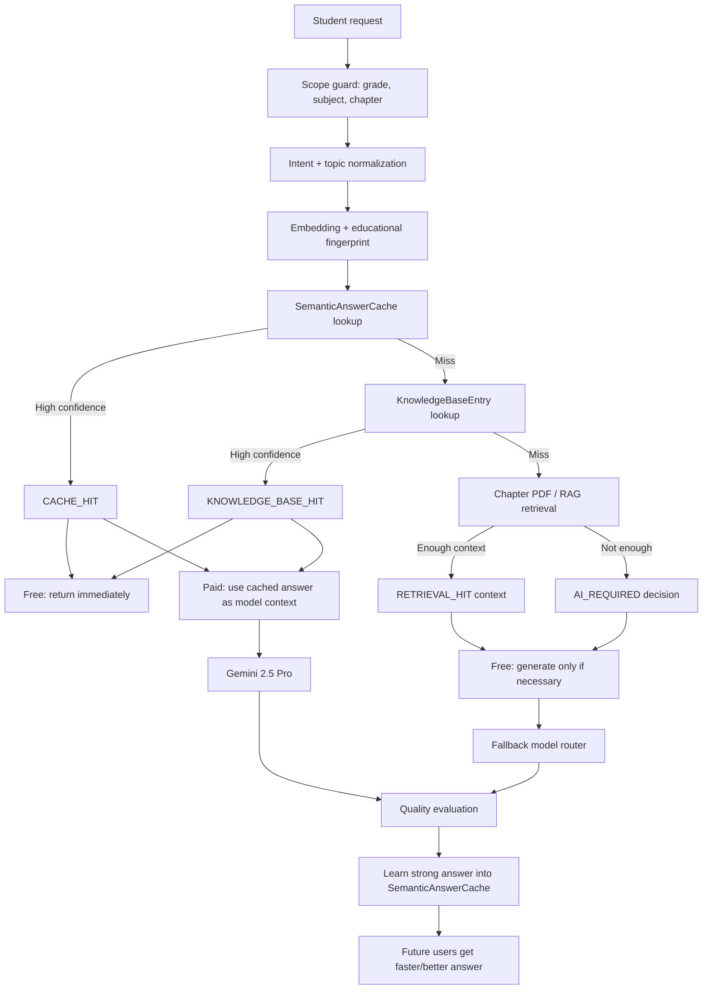

# Noya Educational Cache Architecture

## Goal

Noya should serve most free-tier requests without live AI while improving quality, consistency, latency, and cost. Paid users use Gemini 2.5 Pro first, but cached answers are still used as grounding context.

## Architecture Diagram



## Database Schema

Core tables:

- `KnowledgeBaseEntry`: precomputed textbook-grounded answers.
- `SemanticAnswerCache`: learned answers from strong AI generations.
- `CacheLookupEvent`: audit trail for every routing decision.
- `User.plan_tier`: `free` or `paid`.

Important fields:

- Scope: `grade`, `subject`, `unit`, `chapter`, `chapter_title`
- Education: `topic`, `learning_objective`, `question_type`, `difficulty`, `intent`
- Search: `normalized_query`, `query_fingerprint`, `embedding`
- Quality: `quality_score`, `student_feedback_score`, `textbook_alignment_score`, `hallucination_risk_score`
- Operations: `usage_count`, `hit_count`, `last_verified_at`, `is_active`

## Cache Key Design

Primary fingerprint:

```text
grade | subject | unit | chapter | topic | intent | normalized_query_tokens
```

Example:

```text
10 | social | 1 | 1 | socialization | explain | socialization easy words
```

This prevents cross-chapter leakage while allowing paraphrases to match semantically.

## Embedding Strategy

Current portable implementation:

- Normalizes query text.
- Infers intent.
- Extracts topic.
- Builds a stable hashed vector.
- Uses cosine similarity.

Production upgrade path:

- Replace JSON vector with `pgvector` on Supabase/Postgres.
- Use `text-embedding-004`, `bge-m3`, or `e5-large`.
- Keep the same service interface and thresholds.

## Semantic Search Design

Ranking score:

```text
0.68 * cosine_similarity
+ 0.22 * quality_score
+ 0.07 * feedback_score
- 0.07 * hallucination_risk
```

Thresholds:

- Knowledge base hit: `0.78`
- Paid cache context: `0.82`
- Free cache answer: `0.72`

Free threshold is intentionally lower because free users should reuse strong known answers more often.

## Request Routing

Decision engine outputs:

- `CACHE_HIT`
- `KNOWLEDGE_BASE_HIT`
- `RETRIEVAL_HIT`
- `AI_REQUIRED`

Only `AI_REQUIRED` may call a model.

## Free Request Flow

1. Validate Nepal CDC Grade 10 scope.
2. Normalize intent/topic.
3. Check exact educational fingerprint.
4. Check semantic cache.
5. Check precomputed knowledge base.
6. Check chapter PDF/RAG.
7. Call live AI only if no high-quality answer exists.
8. Learn strong AI answer for future reuse.

## Paid Request Flow

1. Validate scope.
2. Check semantic cache and knowledge base.
3. If hit, include cached answer as context.
4. Call Gemini 2.5 Pro.
5. Fallback only when Gemini is unavailable.
6. Evaluate and cache strong answers.

## Pseudocode

```python
def answer(message, user, context):
    if outside_curriculum(message, context):
        return refusal()

    decision = semantic_cache.inspect(message, context, user.plan_tier)

    if user.plan_tier == "free":
        if decision in [CACHE_HIT, KNOWLEDGE_BASE_HIT]:
            return decision.answer
        retrieval = retrieve_textbook_context(context, message)
        if retrieval.confident:
            return generate_if_needed(retrieval)
        return live_ai_only_if_absolutely_needed()

    if user.plan_tier == "paid":
        cached_context = decision.answer if decision.hit else ""
        answer = gemini_25_pro(message, retrieval_context, cached_context)
        semantic_cache.learn_if_strong(answer)
        return answer
```

## API Endpoints

- `POST /api/cache/inspect/`
  - Returns the routing decision, confidence, and matched cache ID.
- `POST /api/cache/process-content/`
  - Staff-only endpoint that transforms raw textbook content into multiple `KnowledgeBaseEntry` records.
- `GET /api/cache/knowledge/`
  - Lists precomputed entries.
- `POST /api/cache/knowledge/`
  - Staff-only seed endpoint.
- `GET /api/cache/answers/`
  - Lists learned semantic cache entries.
- `GET /api/cache/metrics/`
  - Hit rate, AI-required rate, decision latency, recent events.

## Textbook Content Processor

Request body for `POST /api/cache/process-content/`:

```json
{
  "subject": "social",
  "grade": "10",
  "unit": "1",
  "chapter": "1",
  "chapter_title": "Socialization",
  "topic": "Socialization",
  "raw_textbook_content": "Paste OCR or extracted textbook content here.",
  "save": true
}
```

The processor returns strict JSON, validates it, then stores several cache-ready entries:

- definition
- explanation
- exam notes
- important questions
- quiz
- summary

Offline command:

```bash
python backend-main/manage.py process_textbook_content path/to/chunk.json
python backend-main/manage.py process_textbook_content path/to/chunk.json --dry-run
```

## Background Jobs

Recommended scheduled jobs:

- Nightly precompute missing chapter summaries, notes, FAQs, exercises.
- Weekly reverify stale cache entries.
- Daily deactivate low-feedback or high-risk cache entries.
- Hourly aggregate cache metrics.
- Backfill embeddings after embedding model changes.

## Cache Invalidation

Invalidate or deactivate when:

- Textbook/PDF changes.
- Curriculum locator changes.
- Answer receives repeated negative feedback.
- `last_verified_at` is older than the verification SLA.
- Hallucination risk rises above threshold.

Prefer soft invalidation with `is_active=False` so old answers remain auditable.

## Metrics

Track:

- Cache hit rate.
- Knowledge base hit rate.
- AI required rate.
- Provider fallback count.
- Average cache decision latency.
- Average end-to-end response latency.
- Cost per answer.
- Quality score distribution.
- Negative feedback by subject/chapter.

## Security

- Staff-only cache seeding.
- Never store provider API keys in cache records.
- Keep cache entries scoped by grade/subject/chapter to avoid data leakage.
- Log routing metadata, not private secrets.
- Add abuse limits for free live AI calls.

## Scalability

1,000 DAU:

- SQLite/Postgres JSON vectors are acceptable.
- Cache-first architecture should keep live AI calls below 5-10%.

10,000 DAU:

- Move cache DB to Postgres/Supabase.
- Add Redis for hot cache.
- Use pgvector indexes.
- Add Celery workers for precompute and verification.

100,000 DAU:

- Dedicated vector database or tuned pgvector.
- CDN/static chapter answer bundles.
- Multi-region read replicas.
- Queue all non-urgent generation.
- Strict per-user live AI budgets.
- Offline content generation pipeline.
